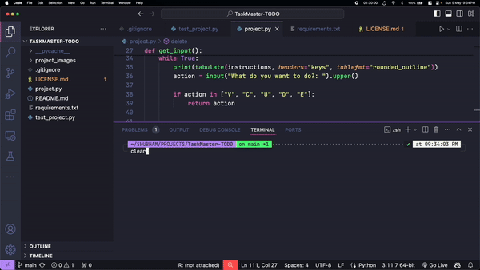

# TaskMaster-TODO
Quick terminal based logical approach for to-do app (this is one of my first projects in python)

#### Description: A interface for to-do list created using Python and tabulate is the library being used for making tables
---
### This was final project developed for CS50P's final submission.
---
### Demo:




## Installation

Use [pip](https://pip.pypa.io/en/stable/) to install the package `tabulate` which is the only requirement.

```
$ pip install tabulate
```

## Usage

Use [python](https://www.python.org/) to run the application
```
$ python project.py
```


Use [pytest](https://docs.pytest.org/en/7.2.x/) to test the application


```
$ pytest test_project.py
```

---

## Contributing

You can pull issues anytime, you are welcome
---
